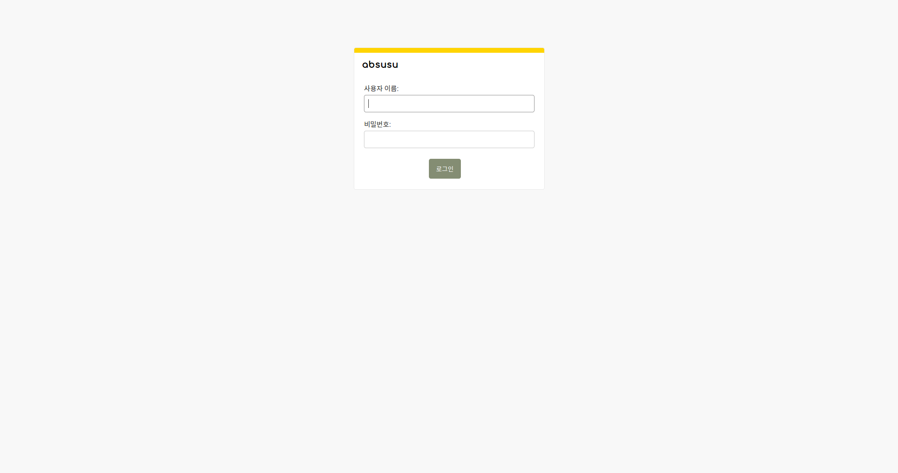
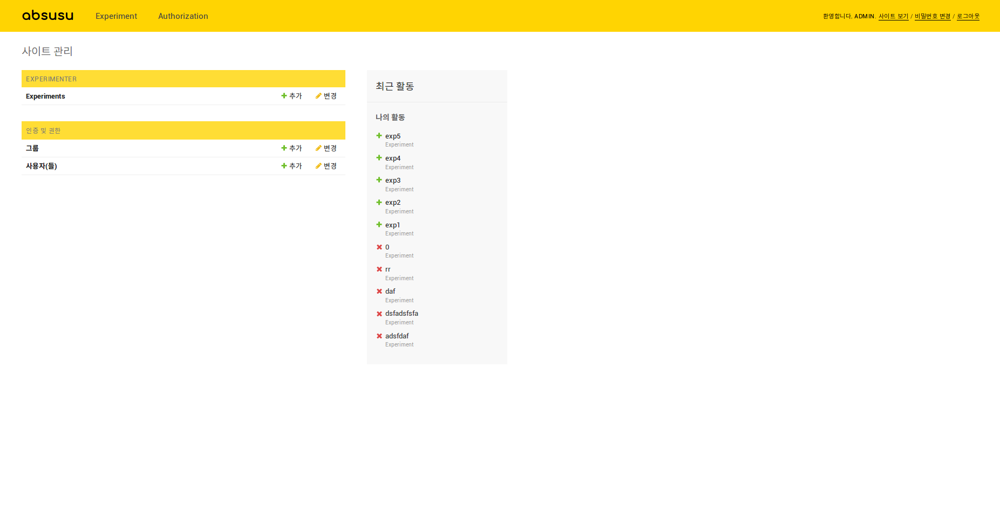
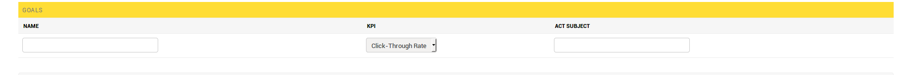

# ABSUSU
ABSUSU는 Python Django 기반의 A/B testing framework입니다.
## 특징
### REST API를 이용한 정보 주고받기
ABSUSU는 [Django Rest Framework](http://www.django-rest-framework.org/)를 이용하여 당신이 실험하고자 하는 웹 어플리케이션과 통신할 수 있습니다. 유저의 행동 정보를 ABSUSU에게 HTTP request로 보내면 ABSUSU가 유저를 어느 집단에 할당할지를 HTTP response로 보낼 것입니다. 이 response의 정보를 이용해 유저들에게 서로 다른 UX를 제공할 수 있습니다.

### UI를 이용한 간단한 실험 생성
ABSUSU는 Django 관리자 페이지를 이용하는 실험 생성 UI를 제공합니다. 이곳에서 실험을 설정하고 생성할 수 있습니다.

### Ramp-up  및 Multi-armed bandit 지원
absusu는 안전한 실험을 위해 ramp up을 지원합니다. 이를 이용해 실험으로 인해 발생하는 이윤 손실을 최소화할 수 있습니다. 또한 더 발전된 실험 알고리즘인 multi-armed bandit을 사용할 수 있습니다. 원할 경우 실험 진행 상황에 따라 실험을 자동 종료하도록 할 수도 있습니다. 이 기능들에 대한 자세한 설명은 아래 'User Guide'를 참고하십시오.

### 대시보드를 통해 실험 결과 제공
ABSUSU는 [Django-controlcenter](https://github.com/byashimov/django-controlcenter)를 이용하여 실험 결과를 대시보드로 제공합니다. 각 실험의 집단별 유저 할당 수와 KPI 수치등을 차트로 보여줍니다. 대시보드는 실험 진행 중에 Ajax를 통해 실시간으로 업데이트됩니다. 
## User Guide
### 필요한 패키지
- python 3.6 이상
- django 1.11
- django-mysql 2.2.0
- django rest framework 3.7.3
- pymysql 0.7.11
- numpy
- scipy
- django-controlcenter 0.2.5
### 설치
ABSUSU는 Django 기반이기 때문에 Django를 배포할 수 있는 어떤 어플리케이션도 지원합니다. 여기에서는 Nginx와 uWSGI를 이용한 배포를 예시로 들 것입니다. 아래 예시는 Ubuntu 16.04 환경에서 진행한 것으로 다른 OS를 사용할 경우 작동하지 않을 수 있습니다.

[참고한 글](https://twpower.github.io/linux/2017/04/13/41(Nginx-uWSGI-Django-%EC%97%B0%EA%B2%B0%ED%95%98%EA%B8%B0).html)

#### 1. 패키지 설치하기

가상환경 위에서 진행하는 것을 권장합니다.

git clone으로 ABSUSU를 설치합니다.
```shell
git clone https://github.com/fuzzysound/absusu
```
ABSUSU에 필요한 패키지들을 설치합니다.
```shell
sudo apt-get install pip
pip install -r absusu/requirement.txt
```
Theano를 import할 때 에러를 방지하기 위해 .bashrc에 다음 라인을 추가합니다.
> `.bashrc`
> ```bash
> export MKL_THREADING_LAYER=GNU
> ```

#### 2. Nginx와 uWSGI 설치하고 설정하기
아래의 명령어로 Nginx를 설치합니다.
```shell
sudo apt-get install nginx
```
설치가 완료되면 아래와 같이 입력합니다.
```shell
sudo service nginx start
```
제대로 설치되었다면 서버의 IP 주소로 브라우저를 통해 접속했을 때 "Welcome to Ngnix!" 화면이 나와야 합니다.
이제 uWSGI를 설치합니다.
```shell
pip install uwsgi
```
Nginx 설정 파일 중 `uwsgi_params` 파일을 복사해 `absusu` 폴더에 붙여넣기합니다.
```shell
cp /etc/nginx/uwsgi_params absusu
```
`absusu` 폴더에 `absusu_backend`라는 이름의 디렉토리를 만들고 그 안에 `backend_nginx.conf`라는 이름의 파일을 다음의 내용으로 만듭니다.
> `backend_nginx.conf`
> ```bash
> upstream django{
>     # Django 서버가 listening할 ip 주소와 포트 번호
>     server 127.0.0.1:8001;
> }
> 
> server{
>     # 외부에서 listening할 포트 번호
>     listen [Port Number];
>     # ABSUSU를 실행하는 서버의 IP주소
>     server_name [IP Address];
>     charset utf-8;
>
>     # 최대 업로드 크기
>     client_max_body_size 75M
>
>     # Django media 파일 경로
>     location /media {
>         alias /home/ubuntu/absusu/absusu_backend/media;
>     }
>
>     # Django static 파일 경로
>     location /static {
>         alias /home/ubuntu/absusu/absusu_backend/static;
>     }
>
>     # media와 static 외의 모든 요청을 upstream으로 보냄
>     location / {
>         uwsgi_pass django;
>         include /home/ubuntu/absusu/uwsgi_params;
>     }
> }
> ```
[] 안의 내용은 직접 작성하시기 바랍니다.
이제 이 파일의 symbolic link를 nginx의 `sites-enabled` 폴더에 추가합니다.
```shell
sudo ln -s /etc/nginx/sites-enabled/
```

#### 3. Django 준비 및 실행하기
`absusu` 폴더로 이동해 다음을 입력합니다. DB에 migrate하고 static file들을 모으는 작업입니다.
```shell
python manage.py makemigrations
python manage.py migrate
python manage.py collectstatic
```
다음으로 nginx를 재시작합니다.
```shell
sudo service nginx restart
```
마지막으로 아래와 같이 입력합니다. 이제 ABSUSU가 실행되었고 외부에서 "http://[도메인 주소]:8001"로 접속할 수 있습니다.
```shell
uwsgi --http :8001 --module absusu.wsgi --check-static /home/ubuntu/absusu/
```
### 실험 생성하기
실험을 생성하기 위해서는 관리자 계정을 생성해야 합니다. 관리자 계정이 없으면 `absusu` 디렉토리에서 다음을 입력합니다.
```shell
python manage.py createsuperuser
```
관리자 계정이 준비되었으면 관리자 페이지('/admin')로 이동합니다. 앞서 생성한 계정을 통해 로그인합니다.



Experimenter 단의 Experiments를 클릭하거나 드롭다운 메뉴의 Experiment에서 Create & Modify를 클릭합니다.



이 페이지에서는 실험을 생성하고 수정할 수 있습니다.
새로운 실험을 생성하기 위해 오른쪽 상단의 __EXPERIMENT 추가__ 버튼을 클릭합니다.


이 페이지에서는 실험을 설정하고 저장합니다.
실험이름, 시작시각, 종료시각, [Multi-Armed Bandit](https://en.wikipedia.org/wiki/Multi-armed_bandit)의 사용여부를 결정합니다.


다음으로 통제집단과 실험집단의 개수, 비율을 정합니다.
실험집단에 한해서 [Ramp up](https://en.wikipedia.org/wiki/Ramp_up)의 사용여부를 결정합니다.


마지막으로 실험의 목표를 설정합니다.
실험대상인 Act subject와 결과지표인 KPI를 설정 후 저장합니다.
예를 들어, 'button1'에 대한 클릭률을 측정하고 싶은 경우 KPI는 Click-Through Rate로, act_subject는 button1으로, name은 button1_ctr 이라고 설정할 수 있습니다.
또한, 'page1'에 대한 평균체류시간을 측정하고 싶은 경우 KPI는 Time on Page로, act_subject는 page1으로, name은 page1_time이라고 설정할 수 있습니다.



#### Ramp up
두 개의 집단으로 이루어진 실험을 진행한다고 가정해봅시다. 두 집단에 1:1로 유저를 할당하는 것은 얼핏 보면 합당해 보입니다. 그러나 만약 실험 집단의 UX가 실제로는 유저들에게 끔찍하게 느껴진다면, 이 집단에 전체 유저의 50%를 할당하는 것은 이윤을 심각하게 해칠 것입니다. Ramp up은 실험 집단에 유저가 할당되는 비율을 점진적으로 높여가며 위험을 최소화하는 방법입니다. absusu에서는 실험 생성 시 Ramp up 항목에서 manual과 automatic 중 하나를 선택함으로써 ramp up을 사용할 수 있습니다.  


Manual ramp up을 사용할 경우, 유저가 실험 집단에 할당되는 비율을 관리자가 직접 변경해주어야 합니다. 가령 두 집단으로 구성된 실험을 하나 만들고 각 집단의 weight를 1로 두었다고 가정합시다. 관리자는 실험 집단에 할당된 유저 중 몇 %를 실험 집단에 '실제로' 할당할지를 ramp up percent 항목에서 정할 수 있습니다. 만약 ramp up percent를 10%로 주었다면, 실험 집단에 실제로 할당되는 유저의 비율은 50%의 10%인 5%입니다. 나머지 95%는 통제 집단에 할당됩니다. 만약 실험 집단의 성과가 나쁘지 않다면 관리자는 실험 수정 기능을 이용해 ramp up percent를 점차적으로 높일 수 있습니다. 최종적으로 ramp up percent를 100%로 설정하면 (혹은 단순히 ramp up을 Don't use로 바꾸면) 실험 집단에 할당되는 유저의 비율이 50%가 될 것입니다. 만약 실험 집단의 성과가 아주 나쁘다면 관리자는 이 실험 집단을 삭제하거나 혹은 아예 실험을 삭제할 수 있습니다.  


Automatic ramp up을 사용할 경우, 유저가 실험 집단에 할당되는 비율이 설정한 시간까지 선형적으로 증가합니다. 이 시간을 ramp up end time에서 설정할 수 있습니다. 실험이 처음 생성되었을 때는 ramp up percent가 0%에서 시작하여 일정한 속도로 증가하다가, ramp up end time에서 설정한 시간이 되면 ramp up percent가 100%로 찹니다. 이 방법은 관리자가 일일이 ramp up percent를 수정해야 하는 수고를 덜어주지만, 대신 특정 집단이 형편없는 성과를 낼 경우 이를 감지하지 못합니다.

#### Multi-armed bandit
위의 ramp up에서 실험으로 인한 이윤 손실을 줄이는 것을 보았습니다. Multi-armed bandit 알고리즘(이하 MAB)은 여기서 더 나아가 이윤 손실을 최소화하기 위해 탐색(exploration)과 이용(exploitation) 간의 최적점을 찾는 알고리즘입니다. absusu에서는 실험 생성 시 Algorith 항목에서 'Multi-armed bandit'을 선택함으로써 MAB를 사용할 수 있습니다. MAB를 사용할 경우 absusu가 실험 진행 상황에 따라 각 집단에 할당되는 애플리케이션 유저의 비율을 주기적으로 바꿔주기 때문에 관리자가 직접 각 집단의 할당 비중을 정해 줄 필요가 없습니다. 대신 이 할당 비율을 얼마나 자주 업데이트할 것인가를 Assignment update interval에서 결정해주어야 합니다. 다음 업데이트 전까지 충분한 표본이 확보되어야 (즉 충분히 많은 사람들이 당신의 웹 페이지를 이용해야) 업데이트가 통계적으로 유의미해진다는 점을 명심하십시오.  


absusu의 MAB 알고리즘은 기본적으로 Thompson sampling을 사용하지만, 구체적인 업데이트 방식은 당신이 사용하는 KPI에 따라 달라집니다. 만약 CTR과 같이 결과가 성공과 실패로 구분되는 KPI를 사용한다면(CTR은 % 단위로 제공되지만, 그 계산 과정에는 성공ㅡ유저가 클릭한 경우ㅡ과 실패ㅡ유저가 클릭하지 않은 경우ㅡ가 관여합니다), absusu는 성공 확률 \theta가 베타 분포를 따른다고 가정하고 각 집단의 베타 분포의 파라미터를 업데이트하며 유저 할당 비율을 업데이트합니다. 만약 체류시간과 같이 결과가 실수 집단의 원소인 KPI를 사용한다면, absusu는 결과가 선형 회귀 모델에 의해 결정되며 이 회귀 모델의 각 계수가 정규분포를 따른다고 가정하고 (이 모델에서 독립변수는 어느 집단을 선택했느냐가 됩니다) 각 정규분포를 비모수적으로 업데이트하며 유저 할당 비율을 업데이트합니다. 여기에는 Markov chain Monte-Carlo 방법의 일종인 NUTS sampling이 사용됩니다(자세한 내용은 [여기](http://docs.pymc.io/notebooks/getting_started.html#Sampling-methods) 참고). Thompson sampling이 이루어지는 구체적인 방식은 [Scott(2014)](https://static.googleusercontent.com/media/research.google.com/en//pubs/archive/42550.pdf)와 [Chapelle&Li(2011)](https://www.microsoft.com/en-us/research/wp-content/uploads/2016/02/thompson.pdf)를 참고하십시오.  
absusu는 실험 진행 상황에 따라 실험을 자동 종료하는 기능도 지원합니다. Auto termination 항목을 체크할 경우 이 기능을 사용할 수 있습니다. 만약 어떤 집단의 성과가 다른 집단에 비해 너무나 명백히 높아서 더 이상 실험을 진행하지 않아도 될 정도일 경우, 당신이 미리 설정한 실험 종료시간에 상관없이 바로 실험이 종료됩니다. 이것이 이루어지는 자세한 원리는 [Scott(2014)](https://static.googleusercontent.com/media/research.google.com/en//pubs/archive/42550.pdf)를 참고하십시오.


### 어플리케이션 상의 추가작업

absusu A/B test platform을 통해 KPI를 계산하기 위해서는 어플리케이션이 올바른 요청을 보내야 합니다.
그리고 KPI에 따라 어플리케이션 웹페이지 상의 추가작업이 필요합니다.

1) Click-Through Rate
관리자가 특정 button, 예를 들어 button1에 대한 CTR에 대한 실험을 exp_button1이라고 생성했다고 가정하겠습니다.
사용자가 button이 포함된 페이지에 접속 시 {'ip': ip, 'action': 'exp_button1_view'} 요청을 post방식으로 보내주어야 합니다.
또한, 그 button을 클릭했을 때 {'ip': ip, 'action': 'button1_click'} 요청을 post방식으로 보내주어야 합니다.


2) Time on Page
관리자가 특정 page, 예를 들어 page1에 대한 Time on Page에 대한 실험을 exp_page1이라고 생성했다고 가정하겠습니다.
사용자가 page에 접속 시 {'ip': ip, 'action': 'exp_page1_view'} 요청을 post방식으로 보내주어야 합니다.
또한, 사용자가 페이지를 떠나면 {'ip': ip, 'action': 'button1_click'} 요청을 post방식으로 보내주어야 합니다.

웹페이지 html파일에 아래와 같은 script를 심어서 사용자가 페이지를 떠나는 행동을 잡아낼 수 있습니다.

```shell
# firefox
<script>
$(window).on('unload', function() {
    $.ajax('/page_leave/', {});
});
</script>

# chrome
<script>
window.onbeforeunload = function() {
  $.ajax('/page_leave/', {});
  }
```

### 대시보드로 실험 진행상황 확인하기 
드롭다운 메뉴의 Experiment에서 Dashboard를 클릭하여 대시보드 페이지로 이동할 수 있습니다. 이 페이지에서는 각 실험들의 유저 할당 비율과 KPI 수치를 시각화된 자료로 확인할 수 있습니다. 모든 수치 및 그래프는 실시간으로 업데이트됩니다.


왼쪽 위의 표에서는 각 실험의 집단별 KPI 수치를 숫자로 확인할 수 있습니다.


오른쪽 위의 파이 그래프에서는 각 집단에 유저가 얼마나 할당되었는지를 실험별로 확인할 수 있습니다.


아래의 라인 그래프에서는 시간에 따른 집단별 KPI 변화를 실험별로 확인할 수 있습니다.


