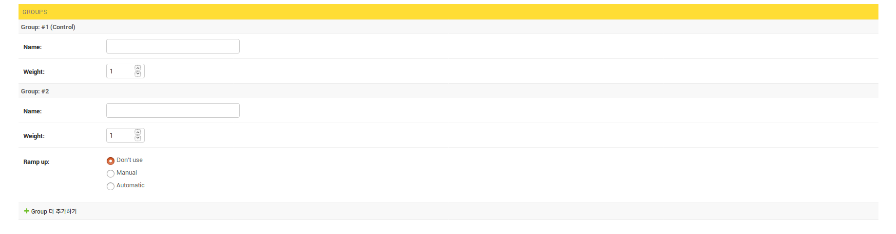

# ABSUSU
ABSUSU는 Python Django 기반의 A/B testing framework입니다.
## 특징
### REST API를 이용한 정보 주고받기
ABSUSU는 [Django Rest Framework](http://www.django-rest-framework.org/)를 이용하여 당신이 실험하고자 하는 웹 어플리케이션과 통신할 수 있습니다. 유저의 행동 정보를 ABSUSU에게 HTTP request로 보내면 ABSUSU가 유저를 어느 집단에 할당할지를 HTTP response로 보낼 것입니다. 이 response의 정보를 이용해 유저들에게 서로 다른 UX를 제공할 수 있습니다.

### UI를 이용한 간단한 실험 생성
ABSUSU는 Django 관리자 페이지를 이용하는 실험 생성 UI를 제공합니다. 코드를 짤 필요 없이 클릭 몇 번만으로 실험 설정을 바꾸고 실험을 생성할 수 있습니다.

### 대시보드를 통해 실험 결과 제공
ABSUSU는 [Django-controlcenter](https://github.com/byashimov/django-controlcenter)를 이용하여 실험 결과를 대시보드로 제공합니다. 각 실험의 집단별 유저 할당 수와 KPI 수치가 파이 차트와 라인 차트로 제시됩니다. 이러한 시각화 자료들은 실험이 진행되는 도중에도 볼 수 있으며 실시간으로 업데이트됩니다. 
## User Guide
### 필요한 패키지
- python 3.6 이상
- django 1.11
- django-mysql 2.2.0
- django rest framework 3.7.3
- pymysql 0.7.11
- numpy
- django-controlcenter 0.2.5
### 설치
ABSUSU는 Django 기반이기 때문에 Django를 배포할 수 있는 어떤 어플리케이션도 지원합니다. 여기에서는 Nginx와 uWSGI를 이용한 배포를 예시로 들 것입니다. 아래 예시는 Ubuntu 16.04 환경에서 진행한 것으로 다른 OS를 사용할 경우 작동하지 않을 수 있습니다.

[참고한 글](https://twpower.github.io/linux/2017/04/13/41(Nginx-uWSGI-Django-%EC%97%B0%EA%B2%B0%ED%95%98%EA%B8%B0).html)

#### 1. 패키지 설치하기

가상환경 위에서 진행하는 것을 권장합니다.

git clone으로 ABSUSU를 설치합니다.
```shell
git clone https://github.com/fuzzysound/absusu
```
ABSUSU에 필요한 패키지들을 설치합니다.
```shell
sudo apt-get install pip
pip install -r absusu/requirement.txt
```


#### 2. Nginx와 uWSGI 설치하고 설정하기
아래의 명령어로 Nginx를 설치합니다.
```shell
sudo apt-get install nginx
```
설치가 완료되면 아래와 같이 입력합니다.
```shell
sudo service nginx start
```
제대로 설치되었다면 서버의 IP 주소로 브라우저를 통해 접속했을 때 "Welcome to Ngnix!" 화면이 나와야 합니다.
이제 uWSGI를 설치합니다.
```shell
pip install uwsgi
```
Nginx 설정 파일 중 `uwsgi_params` 파일을 복사해 `absusu` 폴더에 붙여넣기합니다.
```shell
cp /etc/nginx/uwsgi_params absusu
```
`absusu` 폴더에 `absusu_backend`라는 이름의 디렉토리를 만들고 그 안에 `backend_nginx.conf`라는 이름의 파일을 다음의 내용으로 만듭니다.
> `backend_nginx.conf`
> ```bash
> upstream django{
>     # Django 서버가 listening할 ip 주소와 포트 번호
>     server 127.0.0.1:8001;
> }
> 
> server{
>     # 외부에서 listening할 포트 번호
>     listen [Port Number];
>     # ABSUSU를 실행하는 서버의 IP주소
>     server_name [IP Address];
>     charset utf-8;
>
>     # 최대 업로드 크기
>     client_max_body_size 75M
>
>     # Django media 파일 경로
>     location /media {
>         alias /home/ubuntu/absusu/absusu_backend/media;
>     }
>
>     # Django static 파일 경로
>     location /static {
>         alias /home/ubuntu/absusu/absusu_backend/static;
>     }
>
>     # media와 static 외의 모든 요청을 upstream으로 보냄
>     location / {
>         uwsgi_pass django;
>         include /home/ubuntu/absusu/uwsgi_params;
>     }
> }
> ```
[] 안의 내용은 직접 작성하시기 바랍니다.
이제 이 파일의 symbolic link를 nginx의 `sites-enabled` 폴더에 추가합니다.
```shell
sudo ln -s /etc/nginx/sites-enabled/
```

#### 3. Django 준비 및 실행하기
`absusu` 폴더로 이동해 다음을 입력합니다. DB에 migrate하고 static file들을 모으는 작업입니다.
```shell
python manage.py makemigrations
python manage.py migrate
python manage.py collectstatic
```
다음으로 nginx를 재시작합니다.
```shell
sudo service nginx restart
```
마지막으로 아래와 같이 입력합니다. 이제 ABSUSU가 실행되었고 외부에서 "http://[도메인 주소]:8001"로 접속할 수 있습니다.
```shell
uwsgi --http :8001 --module absusu.wsgi --check-static /home/ubuntu/absusu/
```
### 실험 생성하기
실험을 생성하기 위해서는 관리자 계정을 생성해야 합니다. 관리자 계정이 없으면 `absusu` 디렉토리에서 다음을 입력합니다.
```shell
python manage.py createsuperuser
```
관리자 계정이 준비되었으면 관리자 페이지('/admin')로 이동합니다. 앞서 생성한 계정을 통해 로그인합니다.


Experimenter 단의 Experiments를 클릭합니다.


이 페이지에서는 실험을 생성하고 수정할 수 있습니다.
새로운 실험을 생성하기 위해 오른쪽 상단의 'EXPERIMENT 추가' 버튼을 클릭합니다.


이 페이지에서는 실험을 설정하고 저장합니다.
실험의 이름, 시작시각, 종료시각, [Multi-Armed Bandit](https://en.wikipedia.org/wiki/Multi-armed_bandit)의 사용여부를 결정합니다.


다음으로 통제집단과 실험집단의 개수, 비율을 정합니다.
실험집단에 한해서 [Ramp up](https://en.wikipedia.org/wiki/Ramp_up)의 사용여부를 결정합니다.


마지막으로 실험의 목표를 설정합니다. 
실험대상인 act_subject와 결과지표인 track을 설정 후 저장합니다.


### 결과 확인하기
